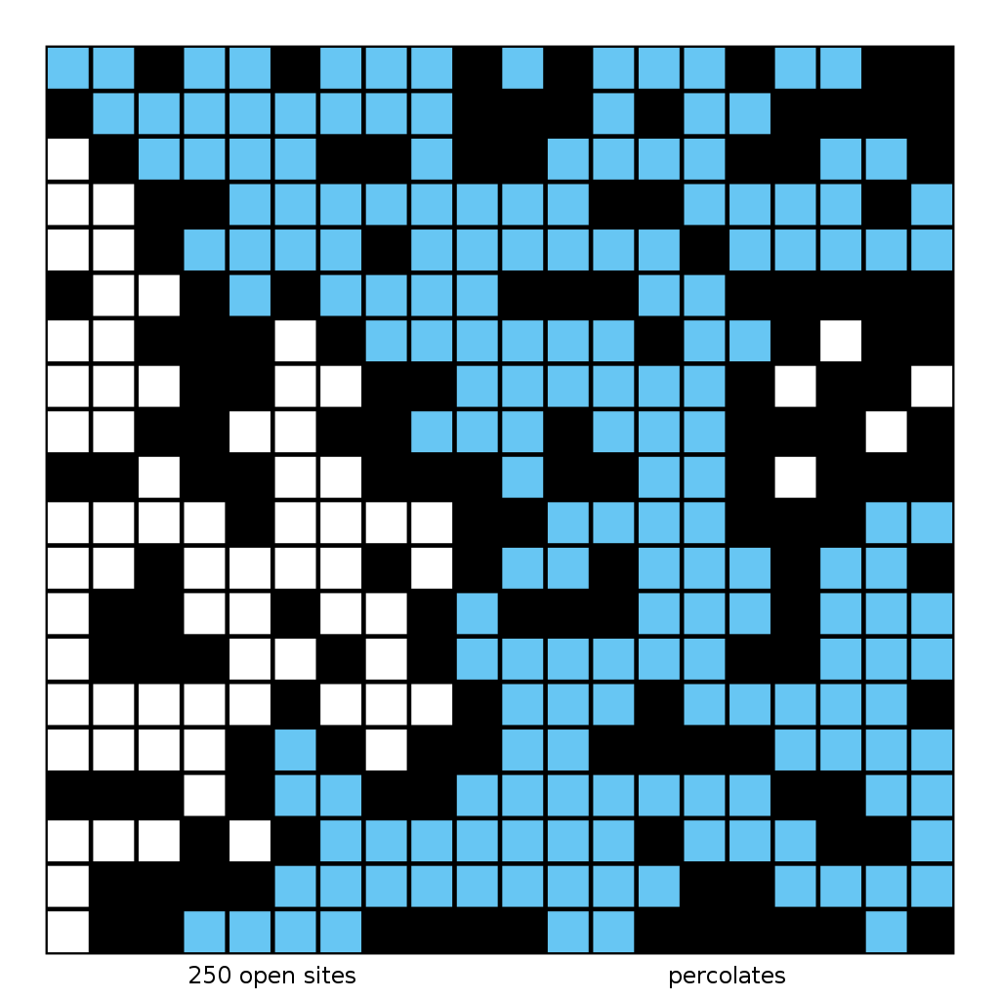
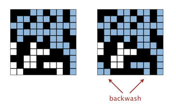
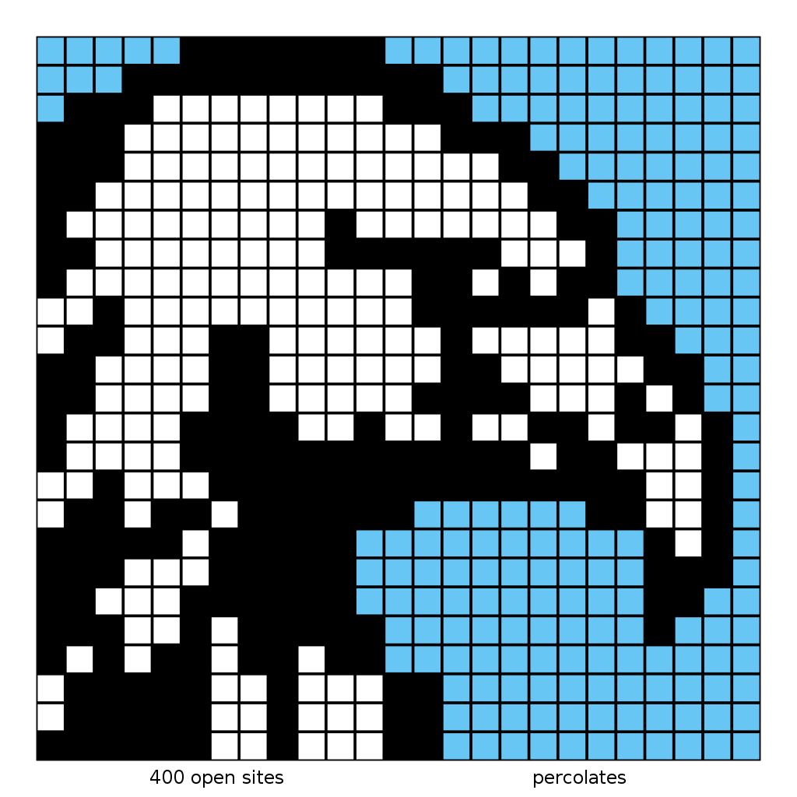
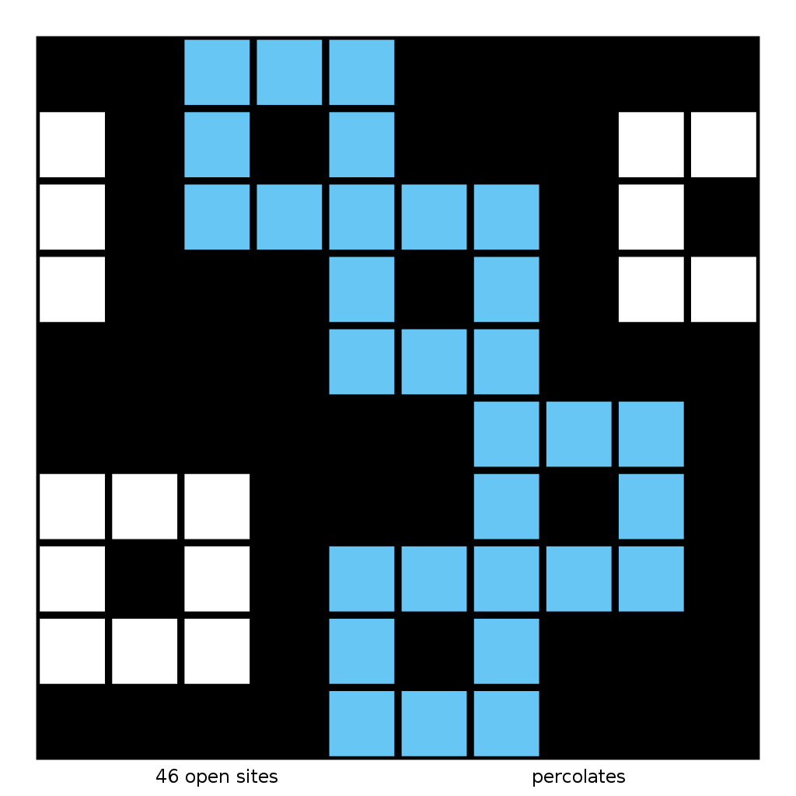
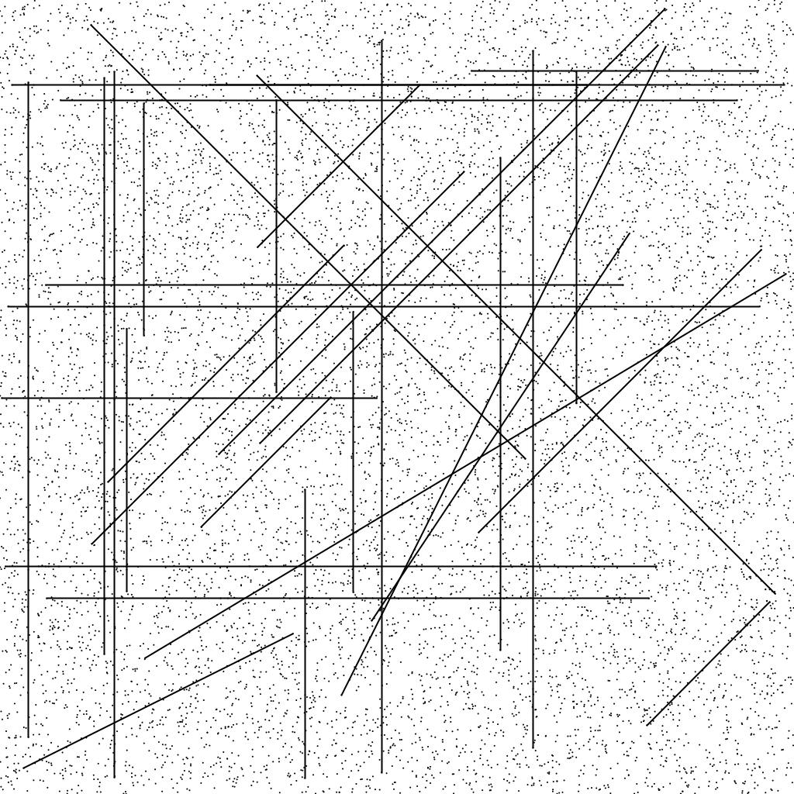
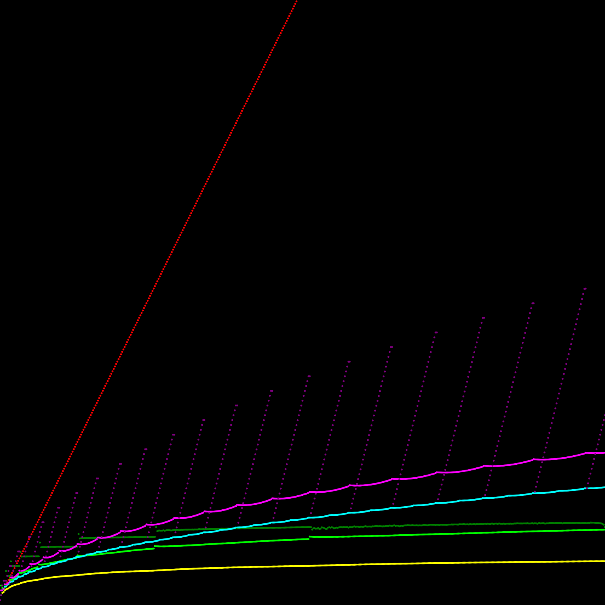
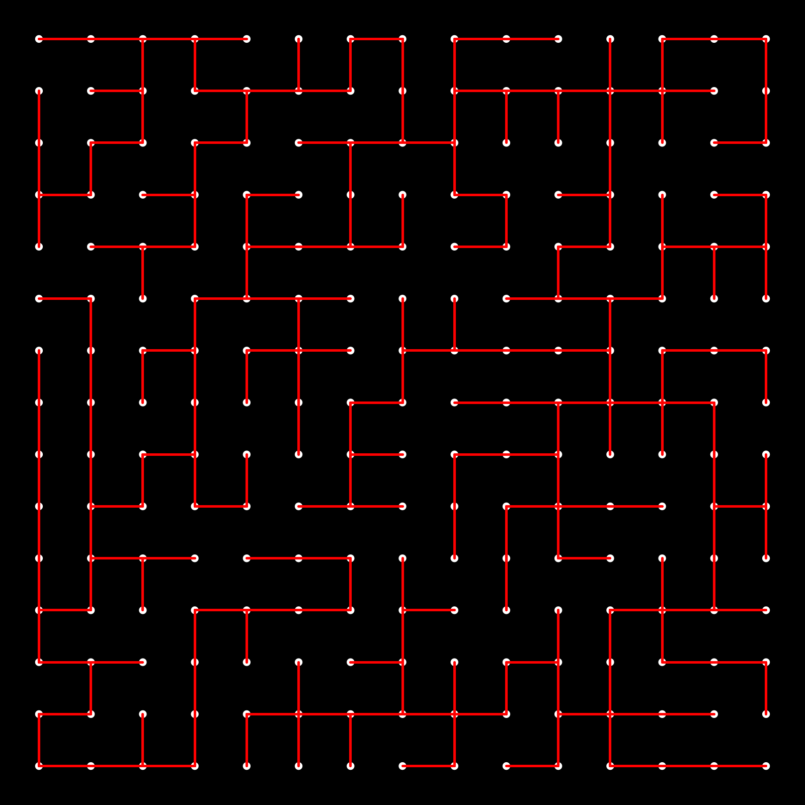
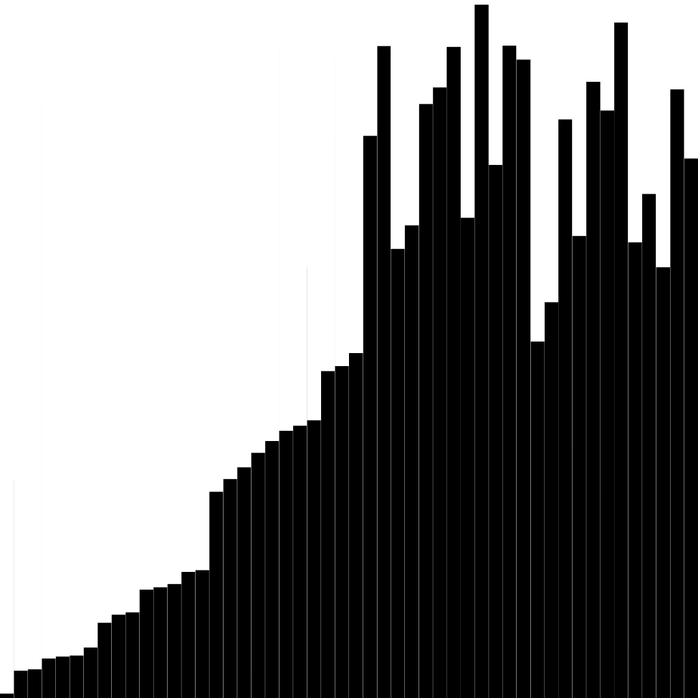

# Algorithms

This repository contains my work for the Algorithms course provided by Princeton. ([Booksite](https://algs4.cs.princeton.edu/home/))

It is assumed anyone exploring this repository is using Linux and has a compatible JDK installed. This repository was developed using OpenJDK 21.0.10 on Ubuntu 24.04.4 LTS running in WSL 2.

# Structure

## Demo script

The top level of this repo contains a demo script `demo.sh`, which allows execution of any individual `.java` file stored in my project directories.

```
./demo.sh example/path/to/AnyJavaFile.java arg1 arg2 arg3
```

The demo script will compile and execute the given Java file, and pass along any number of arguments to the program when executed.

## `lib/`

`lib/` contains Princeton's provided `algs4.jar` archive, as well as a `docgen.sh` script to (1) extract the files in `algs4.jar` to a new directory `lib/algs4_decompressed/`, and (2) generate JavaDocs for those decompressed files, also in a new directory `lib/docs/`. Logs are redirected from stdout and stderr into a new `log.txt`.

# Major Projects

## Queues


This project is about working with arrays and linked lists to create and use abstract data structures. My code fulfills 100% of the testing requirements. See the [specification](https://coursera.cs.princeton.edu/algs4/assignments/queues/specification.php) for more details.

### [Deque.java](queues/Deque.java)

A deque ("deck") is a generalization of both a stack and a queue. It allows for adding an item (of a generic type) to either the front or back, and likewise allows for removing an item from either the front or back.

For constant time complexity in all operations (including the iterator's constructor and methods), `Deque.java` uses a doubly linked list as its underlying data structure.

### [RandomizedQueue.java](queues/RandomizedQueue.java)

A randomized queue is a collection of items that can be randomly retrieved (or simply sampled, without removing them from the queue). Additionally, all iterators of a randomized queue are _distinct_; if two iterators are created from the same randomized queue, they will iterate over the items in _independently_ random orders.

To accomplish this, `RandomizedQueue.java` uses a dynamically resizing array as its underlying data structure. Resizing operations do consume extra time and memory, but the _amortized_ time complexity is still O(1) for all operations besides the iterator constructor, which is O(n).

### [Permutation.java](queues/Permutation.java)

`Permutation.java` is simply a client of `RandomizedQueue.java`. It takes as input _k_ and a set of strings, and prints a randomized subset of length _k_ of the given strings.

Example usage:

```
$ more queues/distinct.txt
A B C D E F G H I

$ ./demo.sh queues/Permutation.java 3 < queues/distinct.txt
B
E
F

$ more queues/tinyTale.txt
it was the best of times it was the worst of times

$ ./demo.sh queues/Permutation.java 5 < queues/tinyTale.txt
best
of
worst
was
was
```

The booksite provides other test input that I've included. Run `tree queues -P *.txt` to see all options.

**Note:** It is assumed that $0 \leq k \leq n$ where _n_ is the number of strings in the input. Violating this will cause a runtime error. For example:

```
$ ./demo.sh queues/Permutation.java 100 < queues/permutation4.txt
D
B
C
A
Exception in thread "main" java.util.NoSuchElementException
        at RandomizedQueue$RandomArrayIterator.next(RandomizedQueue.java:88)
        at Permutation.main(Permutation.java:16)
```

## Percolation


This project is about using a Union-find structure to simulate the abstract scientific concept of percolation. My code fulfills 100% of the testing requirements. See the [specification](https://coursera.cs.princeton.edu/algs4/assignments/percolation/specification.php) for more details.

### Background

Imagine a porous material; how porous does it need to be to allow water to flow all the way through it? Or, imagine a material that is a mixture of a conductor and an insulator; what _ratio_ of conductor to insulator is necessary for the _overall material_ to be conductive? These and other questions are answerable through simulations of percolation.

A material is simulated as a grid of sites. Each site can either be closed (default) or open. An open site would be like a cavity in a porous material, or the conductor in a conductor/insulator mixture. If a site could be reached from the top, it is said to be "full" (analogous to water flowing down through the material, or electricity being supplied from the top). Sites can be randomly opened until the grid has enough open sites to allow flow to go from top to bottom, at which point the grid is said to percolate. The simulation can be repeated for a number of trials, after which statistics can be calculated.

**Note:** The supplied files include Princeton's test clients `PercolationVisualizer.java` and `InteractivePercolationVisualizer.java`, _neither of which I built,_ but both of which use my `Percolation` implementation in this repo. I didn't create the test input files either; I've decided to include the provided [`CREDITS`](percolation/CREDITS) for them as well.

### [Percolation.java](percolation/Percolation.java)



```
./demo.sh percolation/PercolationVisualizer.java percolation/input20.txt
```

`Percolation.java` manages a percolation simulation of an n-by-n grid. Individual grid sites can be opened, or can be checked to determine if they are full. The overall simulation keeps track of how many total sites are open (full or not), and also determines whether or not the grid percolates.

The constructor is $O(n^2)$ due to the grid being n-by-n, but _all other methods are constant time._

- `open(int row, int col)` first opens the specified site (if it isn't already open). Then, it checks all four neighboring sites, calling `union()` if they aren't already connected. (Other complexities are addressed later.)
- `isOpen(int row, int col)` simply checks whether the specified site is open. (Internally this is managed using a `boolean[]` array, so the operation is very simple.)
- `isFull(int row, int col)` checks whether the specified site is in the same Union-find tree as a top virtual node. Think of this top virtual node as representing the water/electricity source; if an open site is in the same Union-find tree as this top virtual node (i.e. they're connected), the open site would be accessible to the water/electricity "coming from" the top virtual node.
- `percolates()` returns the status of an internal flag, but that was not the case at first (explained below).

To determine percolation, my first attempt used a top virtual node and a _bottom_ virtual node. If the top and bottom are connected via some path of open sites, then the system percolates. However, the existence of a bottom node creates a problem known as **backwash** (image taken from [booksite](https://coursera.cs.princeton.edu/algs4/assignments/percolation/faq.php)):



In a grid that percolates, there may be sites connected to the bottom but not _visually_ connected to the top. However, since such bottom open sites are connected to the bottom virtual node, and the bottom virtual node _itself_ is connected to the top virtual node (since the grid percolates), the open sites at the bottom _are_ connected to the top in the underlying Union-find structure. Therefore, since `isFull()` checks whether a site is connected to the top virtual node, _all_ open nodes connected to the bottom will erroneously return `true` in a system that percolates.

To solve this complex problem, the bottom virtual node needs to be removed. `isFull()` won't work otherwise. But that bottom virtual node was being used to determine percolation. So how can percolation be determined without it?

Instead of directly checking the Union-find structure to determine percolation, my `Percolation.java` uses a `boolean[]` array to keep track of all Union-find trees that _touch_ the bottom.

The logic all resides in `open()`. When a site is opened at the bottom of the grid, the tree containing that site (root node accessible via `find()` in the Union-find object) is flagged as connected to the bottom. Then, whenever another tree is merged with any such flagged tree (as may happen in other `open()` calls), the resulting tree necessarily also touches the bottom, so its flag is also updated. Lastly, after all those operations, if the current node being opened is both (1) connected to the bottom and (2) connected to the top, then the system must percolate. No bottom virtual node required!

Using the demo script directly on `Percolation.java` just runs its unit tests. Insetad, to visualize the grid, use Princeton's supplied `PercolationVisualizer.java` with an input file.



```
./demo.sh percolation/PercolationVisualizer.java percolation/eagle25.txt
```

Or, you can use Princeton's supplied `InteractivePercolationVisualizer.java` and make your own pattern. Click on grid sites to open them. (Optionally set the grid size; default size is 10.)



```
./demo.sh percolation/InteractivePercolationVisualizer.java
```

### [PercolationStats.java](percolation/PercolationStats.java)

`PercolationStats.java` runs a Monte Carlo simulation to estimate the percolation threshold. It accepts a grid size `n` and a trial count `T`.

```
./demo.sh percolation/PercolationStats.java 200 100
mean                    = 0.5921590000000002
stddev                  = 0.009801390413630305
95% confidence interval = [0.5902379274789287, 0.5940800725210718]
```

So, using these percolation simulations, the threshold of sites that need to be open in order for the grid to percolate is, on average, just above 59%. (At least in 2D!)

## Collinear Points



Given a set of points, there may be subsets of four or more points that lie along the same line. What is the _fastest_ way to find all such lines?

My code fulfills 100% of the testing requirements. See the [specification](https://coursera.cs.princeton.edu/algs4/assignments/collinear/specification.php) for more details.

### [Point.java](collinear_points/Point.java)

`Point.java` defines a `Point` data type. Some of its methods are provided by Princeton, but three methods use my own implementations.

* `compareTo(Point that)` allows `Point`s to be compared. Each y-coordinate is compared, using the x-coordinate to break ties. This method allows `Point` to implement `Comparable`.
* `slopeTo(Point that)` calculates the slope between two points. If the points are horizontal, the slope is `+0.0`; if the points are vertical, the slope is `Double.POSITIVE_INFINITY`; if the points are identical, the slope is `Double.NEGATIVE_INFINITY`.
* `slopeOrder()` returns a `Comparator<Point>` such that it orders points by the slope they make _with the calling point_. For example, imagine three points `(2, 2)`, `(3, 1)`, and `(3, 3)`. If the latter two points were to be sorted by `new Point(2, 2).slopeOrder()`, the result would be `[(3, 3), (3, 1)]`, since the slope from `(2, 2)` to `(3, 3)` is greater than the slope from `(2, 2)` to `(3, 1)`.

### [BruteCollinearPoints.java](collinear_points/BruteCollinearPoints.java)

`BruteCollinearPoints.java` finds all sets of four or more collinear points using a brute-force searching algorithm. It examines all possible 4-point tuples in the input and determines whether they are collinear.

* `BruteCollinearPoints(Point[] points)` runs the searching algorithm and stores all found segments.
* `segments()` returns (a copy of) all found segments.
* `numberOfSegments()` simply returns how many segments were found.

Despite some minor optimizations, the core structure is four nested loops. Therefore, the overall time complexity is $O(n^4)$. Additionally, this algorithm is unable to find line segments containing _more_ than four points.

### [FastCollinearPoints.java](collinear_points/FastCollinearPoints.java)

`FastCollinearPoints.java` overcomes the limitations of its brute-force counterpart.

In terms of its API, it is essentially identical:

* `FastCollinearPoints(Point[] points)` runs the searching algorithm and stores all found segments.
* `segments()` returns (a copy of) all found segments.
* `numberOfSegments()` simply returns how many segments were found.

The magic is that the searching algorithm uses multiple sorts to accomplish its task in $O(n^2\log n)$ time!

For each point `currentPoint` in the input array, the points are sorted by the slope they make with `currentPoint` -- an $O(n \log n)$ operation repeated for every point, explaining the overall time complexity. Java offers an alias of `Arrays.sort()` that accepts a `T[]` and a `Comparator<T>`, making the operation plug-and-play with `currentPoint.slopeOrder()`. Then, if three or more points in the sorted array make the same slope with `currentPoint`, a collinear segment _may_ be found. To remove duplicates, the segment only counts if `currentPoint` is the _least_ point in the subset.

Additionally, once a subset of collinear points is found, there is the problem of deciding which points act as the beginning and end of the `LineSegment` to be added. To accomplish this, the collinear point subset is sorted _again_, this time simply by `Point.compareTo()` (invoked internally by another alias of `Arrays.sort()`). From the resulting array, the first point becomes the beginning of the `LineSegment`, and the last point becomes the end of the `LineSegment`. This ensures that no matter what order the points are encountered in, the resulting `LineSegment` for any permutation of collinear points is always the same.

Not only is this algorithm much faster than the brute-force method, it also supports line segments containing _more than_ 4 points.

### [CollinearPointsClient.java](collinear_points/CollinearPointsClient.java)

`CollinearPointsClient.java` accepts an input file, and using `FastCollinearPoints`, finds all line segments containing four or more points, displays the number of segments found and the time it took, and draws all the points and line segments.

The picture at the beginning of this section was obtained using this command:

```
$ ./demo.sh collinear_points/CollinearPointsClient.java collinear_points/input10000.txt 
35 segment(s) found in 17.437 seconds
(1930, 8070) -> (26781, 8070)
(351, 20127) -> (31354, 20127)
(14588, 8324) -> (14588, 19900)
(12581, 659) -> (12581, 12555)
(225, 9391) -> (27077, 9391)
```
...and so on. There are many other test files to try.

# Chapter Exercises & Problems

These are smaller projects from each chapter that I decided to do, for one reason or another. The `demo.sh` can run them all the same.

## Chapter 1: Fundamentals

### Basic Programming Model

#### BinarySearch

Simply a copy of some code listed in the book. I did this mainly as a "hello world" for my editing setup, and a test file for working out both the structure of this repo and the mechanics of the shell scripts.

`BinarySearch.java` checks input numbers against a set of whitelisted numbers, using a binary search algorithm to determine whether numbers from stdin are in the whitelist.

```
./demo.sh ch1_fundamentals/basic_programming_model/BinarySearch.java ch1_fundamentals/basic_programming_model/numsW.txt < ch1_fundamentals/basic_programming_model/numsT.txt
```

The above should output the three numbers in `numsT.txt` not present in `numsW.txt`: 15, 33, and 98. (Notice that `demo.sh` allows stdin redirection.)

#### RandomConns

Draws a circle of `N` points, and with probability `p` connects each pair of points.

```
./demo.sh ch1_fundamentals/basic_programming_model/RandomConns.java N p
```

Some values to try:
| N | p |
| - | - |
| 10 | 0.5 |
| 30 | 0.2 |
| 200 | 0.01 |

### Data Abstraction

#### Interval2DClient

Uses the provided `Interval2D` class to create N 2-dimensional intervals dispersed randomly through the unit square, where each `Interval2D` is bounded by provided min and max values. All `Interval2D`s are drawn and compared, with basic stats printed to stdout.

```
./demo.sh ch1_fundamentals/data_abstraction/Interval2DClient.java N min max
```

Some values to try:
| N | min | max |
| - | - | - |
| 5 | 0.2 | 0.8 |
| 20 | 0.05 | 0.3 |
| 100 | 0 | 0.1 |
| 100 | 0 | 0.5 |
| 100 | 0 | 1 |

#### Rational

An ADT (abstract data type) for storing rational numbers. The book outlines an API:


As a bonus, my `Rational` ADT also controls for integer overflow and underflow.

The `main` method of [`Rational.java`](./ch1_fundamentals/data_abstraction/Rational.java) includes assertions to test functionality; see that method for more details. (Using the demo script on `Rational.java` will produce no output, since all assertions pass.)

### Bags, Queues, and Stacks

#### ResizingArrayStack, Stack, Queue, Bag

These were all mostly retyped from the book. I did this to deeply understand their implementations before working up to other exercises, and ultimately the Queues project.

Each of these programs' main methods contains unit tests, some of which produce output (mostly nonsense testing variables).

[ResizingArrayStack.java](ch1_fundamentals/bags_queues_stacks/ResizingArrayStack.java) is implemented using a dynamically resizing array. [Stack.java](ch1_fundamentals/bags_queues_stacks/Stack.java) uses a (singly) linked list, as do [Queue.java](ch1_fundamentals/bags_queues_stacks/Queue.java) and [Bag.java](ch1_fundamentals/bags_queues_stacks/Bag.java).

#### LinkedListGeneric

This class meets many (though not all) of the linked list exercises found in the book. I built this class to better understand how to work with linked lists, again before starting work on the Queues project.

#### Parentheses (and ParenthesesTest)

`Parentheses.java` takes a string of parentheses, braces, and brackets, and using a Stack (from [Stack.java](ch1_fundamentals/bags_queues_stacks/Stack.java)), determines whether it is a valid sequence. `ParenthesesTest.java` was simply for TDD.

```
$ ./demo.sh ch1_fundamentals/bags_queues_stacks/Parentheses.java "(()"
false

$ ./demo.sh ch1_fundamentals/bags_queues_stacks/Parentheses.java "[{}({}[])]"
true
```

### Analysis of Algorithms

#### DoublingTest, ThreeSum

These were more or less retyped from the book. `ThreeSum.java` expects a series of integers from stdin, after which it will run a static method `count`, a cubic-time algorithm to find all triples that sum to 0. It also includes a static method `countFast` that works in quadratic + logarithmic time, $O(n^2\lg(n))$. (This is because a binary search is executed $n^2$ times.)

`DoublingTest.java` tests progressively larger (randomly generated) arrays against `countFast`, printing the input size and time elapsed to stdout.

```
$ ./demo.sh ch1_fundamentals/analysis_of_algorithms/DoublingTest.java
    250   0.0
    500   0.0
   1000   0.0
   2000   0.1
   4000   0.3
   8000   1.1
  16000   4.4
  32000  18.4
```

#### ClosestPair, DoublingRatio (plus Pair, GenerateDoubles)

`ClosestPair.java` takes a series of numbers (Java `double`s) from stdin and using its own static method `findClosestPair`, finds the closest pair of them. Instead of searching every pair, the input is first sorted and then traversed in linear time. Given that Java's `Arrays.sort` is linearithmic, the overall performance of `findClosestPair` is also linearithmic, $O(n\lg(n))$.

The return value of `findClosestPair` is a custom ADT `Pair`, which is a simple pair of two generic variables. I created it just so that I can return two values at once, which Java doesn't natively allow.

`DoublingRatio.java` is a copy of `DoublingTest.java` with modifications: (1) it tests `findClosestPair`, (2) it runs batches of timed trials and calculates an average time, and (3) it calculates the ratio of different problem sizes, printed to a third column.

In this case, since the algorithm in question is linearithmic, doubling the problem size takes slightly more than double the time, on average.

```
$ ./demo.sh ch1_fundamentals/analysis_of_algorithms/DoublingRatio.java
    250   0.0   0.0
    500   0.0   NaN
   1000   0.0   NaN
   2000   0.0 Infinity
   4000   0.0   2.0
   8000   0.0   1.0
  16000   0.0   2.5
  32000   0.0   1.4
  64000   0.0   1.4
 128000   0.0   2.2
 256000   0.0   1.2
 512000   0.0   1.4
1024000   0.1   2.1
2048000   0.2   2.0
4096000   0.3   2.1
8192000   0.7   2.1
16384000   1.3   2.0
32768000   3.0   2.2
65536000   5.9   2.0
131072000  12.8   2.2
Exception in thread "main" java.lang.OutOfMemoryError: Java heap space
```

Also, `GenerateDoubles.java` is just for generating a list of random doubles, in case you want to run `ClosestPair.java` without using `DoublingRatio.java`. It generates N doubles and prints them to stdout.

```
./demo.sh ch1_fundamentals/analysis_of_algorithms/GenerateDoubles.java 3
-130239.18919157668
-896684.4776422336
875496.4231525634
```

`1Mdoubles.txt` was generated using `GenerateDoubles.java`. It's nearly 18Mb, so open it with caution.

```
$ ./demo.sh ch1_fundamentals/analysis_of_algorithms/ClosestPair.java < ch1_fundamentals/analysis_of_algorithms/1Mdoubles.txt
(999996.1746621621, 999999.1425217595)
```

#### ThrowEggs (and Building)



```
./demo.sh ch1_fundamentals/analysis_of_algorithms/ThrowEggs.java 500
```

`ThrowEggs` contains my solutions to four versions of one of the creative problems listed in the book.

The problems are about dropping eggs from different floors of a building to determine the lowest floor at which eggs will crack when dropped. The height of the building is N, and the target floor is F. `Building.java` is just a handy way to encapsulate those two variables, such that after creating a `Building`, I can get how many floors it has but _cannot_ simply access its target floor. I also made a test method `throwEgg(int floor)` that returns a boolean indicating whether the egg dropped from the given floor cracked or not.

- The red line is $O(N)$ -- drop an egg at consecutive floors, starting from the bottom, until the correct floor is found. This is a basic linear solution, but I can do better.

- The yellow line is $O(\lg(N))$. Start at the middle floor, and based on whether the egg cracks, search the corresponding half in the same manner -- if cracked, search below; if not cracked, search above. Repeat until the window of possible floors is narrowed to one floor.

- The green lines are $O(\lg(F))$, using an algorithm based not on the total size of the building N, but on the target floor F. Starting at the ground floor, move to the next power-of-2 floor (0 &#8594; 1 &#8594; 2 &#8594; 4 etc.) until finding a floor where the egg breaks. Then, binary-search the last "chunk" between the known egg-cracking floor and the previous non-egg-cracking floor. The lighter green line represents the average number of throws per building size; the darker green line represents the average number of throws _depending on F_, i.e. the x-axis is F instead of N.

- The cyan line is $O(\sqrt{N})$ when given **_only two eggs!_** This is accomplished by dividing the building into "chunks" of size $\sqrt{N}$. Drop the first egg at the beginning of every chunk, starting at the first floor, until finding the first chunk where the egg cracks. Then, search the previous chunk one floor at a time (ascending).

- The purple lines are $O(\sqrt{F})$, also when given **_only two eggs._** Instead of using chunks of size $\sqrt{N}$, use chunks between _squares_! Starting at the bottom floor, move to the next square floor (0 &#8594; 1 &#8594; 4 &#8594; 9 etc.) until the first egg cracks. Then, move back to the previous square floor and search one floor at a time (ascending). As with the green lines, the ligher purple line represents the average number of throws per building size, and the darker purple points represent the average number of throws _depending on F_.

### Case Study: Union-Find

#### UF, QuickFindUF, QuickUnionUF, WeightedQuickUnionUF

These were retyped from the book, mostly to check my understanding of what exactly each version of Union-find was doing.

- `UF.java` isn't functional, and was used as a base for building the others (to avoid particularly tedious retyping). The methods `union()` and `find()` simply throw errors.

- `QuickFindUF.java` is an implementation of Union-find that uses an internal `id[]` to track which nodes of the graph are connected to which other nodes. `find()` is quick because it simply returns `id[p]` for any point `p`. However, `union()` is very inefficient because when the two specified points aren't already connected, actually connecting them involves traversing the full `id[]` array.

- `QuickUnionUF.java` is an attempt to solve the QuickFind problem by creating a conceptual tree structure in `id[]`, where if `id[x] == y`, then `x` is a child node to `y` the parent node. Thus also if `id[x] == x` itself, then `x` is the root of a tree. This approach turns out to slow down `find()` slightly, since it requires traversing a tree to find the root node of the input point. But `union()` only requires merging two trees, which is a relatively fast and easy task: set `id[firstRoot] = secondRoot`. The oversight here is that the trees can get tall, so traversing trees can still take a while.

- `WeightedQuickUnionUF.java` controls how tall any individual tree can get by tracking the sizes of each tree in a new `sz[]` array, such that the size of any tree whose root node is point `p` is `sz[p]`. (For clarity, "size" here does _not_ refer to the height of the tree, but to the number of nodes it contains. That said, this ultimately still controls tree height.) So, instead of blindly merging pairs of trees into potentially tall and inefficient configurations, `union()` can now check the size of both trees and merge the smaller tree into the larger one.

All of these (except `UF.java`) can be run from the command line with an input file. The provided test input files begin with a grid size, and then a series of coordinate pairs (1-indexed, from top left). Each Union-find implementation relays the points that, given that specific sequence of coordinate pairs, are not _already in the same group_ when they are encountered. They then list the number of groups (components) in the Union-find structure, as well as how long it took to process all of the inputs.

```
$ more ch1_fundamentals/union_find/tinyUF.txt
10
4 3
3 8
6 5
9 4
2 1
8 9
5 0
7 2
6 1
1 0
6 7

$ ./demo.sh ch1_fundamentals/union_find/WeightedQuickUnionUF.java < ch1_fundamentals/union_find/tinyUF.txt
4 3
3 8
6 5
9 4
2 1
5 0
7 2
6 1
2 components
0.005 seconds
```

Notice for example that `8 9` was not relayed because by that point, they were already connected via `4 3`, `3 8`, and `9 4`.

#### RandomGrid (and Connection)

The main method of `RandomGrid.java` takes a grid size from stdin and outputs all adjacent pairs of points in the grid, in random order, with coordinates shuffled, e.g. the pair `(2, 5)` is as likely as `(5, 2)`. (The ADT `Connection.java` encapsulates each connection.)

```
$ ./demo.sh ch1_fundamentals/union_find/RandomGrid.java 3
(6, 7)
(0, 3)
(1, 4)
(6, 3)
(5, 8)
(1, 2)
(5, 2)
(4, 5)
(7, 8)
(4, 7)
(4, 3)
(1, 0)
```

Internally, `RandomGrid.java` has a static method `generate()` that actually does all of the work. In turn, `generate()` uses a copy of `RandomizedQueue.java` from my Queues project to randomly order the connections.

#### GridAnimation



```
./demo.sh ch1_fundamentals/union_find/GridAnimation.java 15
```

`GridAnimation.java` takes a grid size N from stdin and draws random connections on an N-by-N grid, using a Union-find structure to check connectivity. Visually, this ensures the line never loops! It uses `generate()` from `RandomGrid.java` to create all of the connections.

## Chapter 2: Sorting

Instead of nesting programs in subdirectories for each chapter section, I'll organize this section by program. I did this because it makes more sense to put all the sorting algorithms in one Java program, since they all use the same `exch()` and `less()` methods, and will all be tested in similar ways.

### Sorter

A `Sorter` can sort any `Comparable[]`, using any of its specified methods for doing so. Optionally, its constructor can accept a flag for whether it should draw the sorting process (if the array is a `Double[]`).

- `sortUsing(Comparable[] a, String alg)` checks whether the given algorithm name is one of the sorting methods provided, and if so, uses that algorithm to sort the given array.
- Every sorting algorithm has its own method, which is its name minus "sort" at the end, e.g. shellsort is implemented in `shell(Comparable[] a)`.
- `main()` accepts a series of strings, sorts them, uses a private method to check that the sorting algorithm was successful, and prints the sorted array contents to stdout. It's useful for testing new sorting methods when I add them. I've included a `tiny.txt` for testing this.

### SortCompare

`SortCompare.java` can compare the time performance of two sorting algorithms head-to-head. Specify the names of two algorithms, the array size to use, and the number of trials to run.

```
./demo.sh -i ch2_sorting/SortCompare.java shell insertion 500 100
For 500 random Doubles
   shell is 11.05 times faster than insertion
```

**Note:** When comparing sorting methods, _always_ use my demo script's flag `-i` to switch from JIT compilation to interpreted mode. This will make the program overall slower, but will more accurately reflect the performance of the algorithms head-to-head. The JIT compiler uses optimizations that mess with the timings by default.

Notice the timing difference:

```
$ ./demo.sh ch2_sorting/SortCompare.java insertion selection 200 500
For 200 random Doubles
   insertion is 0.77 times faster than selection

$ ./demo.sh -i ch2_sorting/SortCompare.java insertion selection 200 500
For 200 random Doubles
   insertion is 1.40 times faster than selection
```

### DisplaySorts

`DisplaySorts.java` displays the sorting process as it happens! Specify an array size and the sorting algorithm to use.



```
./demo.sh ch2_sorting/DisplaySorts.java 50 selection
```