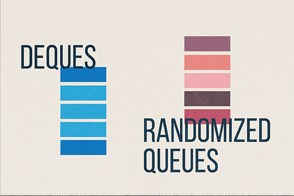
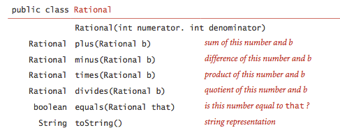

# Algorithms

This repository contains my work for the Algorithms course provided by Princeton. ([Booksite](https://algs4.cs.princeton.edu/home/))

It is assumed anyone exploring this repository is using Linux and has a compatible JDK installed. This repository was developed using OpenJDK 21.0.10 on Ubuntu 24.04.4 LTS running in WSL 2.

# Structure

## Demo script

The top level of this repo contains a demo script `demo.sh`, which allows execution of any individual `.java` file stored in my project directories.

```
./demo.sh example/path/to/AnyJavaFile.java arg1 arg2 arg3
```

The demo script will compile and execute the given Java file, and pass along any number of arguments to the program when executed.

## `lib/`

`lib/` contains Princeton's provided `algs4.jar` archive, as well as a `docgen.sh` script to (1) extract the files in `algs4.jar` to a new directory `lib/algs4_decompressed/`, and (2) generate JavaDocs for those decompressed files, also in a new directory `lib/docs/`. Logs are redirected from stdout and stderr into a new `log.txt`.

# Major Projects

## Queues



This project is about working with arrays and linked lists to create and use abstract data structures. See the [specification](https://coursera.cs.princeton.edu/algs4/assignments/queues/specification.php) for more details.

### [Deque.java](queues/Deque.java)

A deque ("deck") is a generalization of both a stack and a queue. It allows for adding an item (of a generic type) to either the front or back, and likewise allows for removing an item from either the front or back.

For constant time complexity in all operations (including the iterator's constructor and methods), `Deque.java` uses a doubly linked list as its underlying data structure.

### [RandomizedQueue.java](queues/RandomizedQueue.java)

A randomized queue is a collection of items that can be randomly retrieved (or simply sampled, without removing them from the queue). Additionally, all iterators of a randomized queue are *distinct*; if two iterators are created from the same randomized queue, they will iterate over the items in *independently* random orders.

To accomplish this, `RandomizedQueue.java` uses a dynamically resizing array as its underlying data structure. Resizing operations do consume extra time and memory, but the *amortized* time complexity is still O(1) for all operations besides the iterator constructor, which is O(n).

### [Permutation.java](queues/Permutation.java)

`Permutation.java` is simply a client of `RandomizedQueue.java`. It takes as input *k* and a set of strings, and prints a randomized subset of length *k* of the given strings.

Example usage:

```
$ more queues/distinct.txt
A B C D E F G H I

$ ./demo.sh queues/Permutation.java 3 < queues/distinct.txt
B
E
F

$ more queues/tinyTale.txt 
it was the best of times it was the worst of times

$ ./demo.sh queues/Permutation.java 5 < queues/tinyTale.txt
best
of
worst
was
was
```

The booksite provides other test input that I've included. Run `tree queues -P *.txt` to see all options.

**Note:** It is assumed that $ 0 \leq k \leq n $ where *n* is the number of strings in the input. Violating this will cause a runtime error. For example:

```
$ ./demo.sh queues/Permutation.java 100 < queues/permutation4.txt
D
B
C
A
Exception in thread "main" java.util.NoSuchElementException
        at RandomizedQueue$RandomArrayIterator.next(RandomizedQueue.java:88)
        at Permutation.main(Permutation.java:16)
```

# Chapter Exercises & Problems

These are smaller projects from each chapter that I decided to do, for one reason or another. The `demo.sh` can run them all the same.

## Chapter 1: Fundamentals

### Basic Programming Model

#### BinarySearch

Simply a copy of some code listed in the book. I did this mainly as a "hello world" for my editing setup, and a test file for working out both the structure of this repo and the mechanics of the shell scripts.

`BinarySearch.java` checks input numbers against a set of whitelisted numbers, using a binary search algorithm to determine whether numbers from stdin are in the whitelist.

```
./demo.sh ch1_fundamentals/basic_programming_model/BinarySearch.java ch1_fundamentals/basic_programming_model/numsW.txt < ch1_fundamentals/basic_programming_model/numsT.txt
```

The above should output the three numbers in `numsT.txt` not present in `numsW.txt`: 15, 33, and 98. (Notice that `demo.sh` allows stdin redirection.)

#### RandomConns

Draws a circle of `N` points, and with probability `p` connects each pair of points.

```
./demo.sh ch1_fundamentals/basic_programming_model/RandomConns.java N p
```

Some values to try:
| N | p |
| - | - |
| 10 | 0.5 |
| 30 | 0.2 |
| 200 | 0.01 |

### Data Abstraction

#### Interval2DClient

Uses the provided `Interval2D` class to create N 2-dimensional intervals dispersed randomly through the unit square, where each `Interval2D` is bounded by provided min and max values. All `Interval2D`s are drawn and compared, with basic stats printed to stdout.

```
./demo.sh ch1_fundamentals/data_abstraction/Interval2DClient.java N min max
```

Some values to try:
| N | min | max |
| - | - | - |
| 5 | 0.2 | 0.8 |
| 20 | 0.05 | 0.3 |
| 100 | 0 | 0.1 |
| 100 | 0 | 0.5 |
| 100 | 0 | 1 |

#### Rational

An ADT (abstract data type) for storing rational numbers. The book outlines an API:



As a bonus, my `Rational` ADT also controls for integer overflow and underflow.

The `main` method of [`Rational.java`](./ch1_fundamentals/data_abstraction/Rational.java) includes assertions to test functionality; see that method for more details. (Using the demo script on `Rational.java` will produce no output, since all assertions pass.)

### Bags, Queues, and Stacks

#### ResizingArrayStack, Stack, Queue, Bag

These were all mostly retyped from the book. I did this to deeply understand their implementations before working up to other exercises, and ultimately the Queues project.

Each of these programs' main methods contains unit tests, some of which produce output (mostly nonsense testing variables).

[ResizingArrayStack.java](ch1_fundamentals/bags_queues_stacks/ResizingArrayStack.java) is implemented using a dynamically resizing array. [Stack.java](ch1_fundamentals/bags_queues_stacks/Stack.java) uses a (singly) linked list, as do [Queue.java](ch1_fundamentals/bags_queues_stacks/Queue.java) and [Bag.java](ch1_fundamentals/bags_queues_stacks/Bag.java).

#### LinkedListGeneric

This class meets many (though not all) of the linked list exercises found in the book. I built this class to better understand how to work with linked lists, again before starting work on the Queues project.

#### Parentheses (and ParenthesesTest)

`Parentheses.java` takes a string of parentheses, braces, and brackets, and using a Stack (from [Stack.java](ch1_fundamentals/bags_queues_stacks/Stack.java)), determines whether it is a valid sequence. `ParenthesesTest.java` was simply for TDD.

```
$ ./demo.sh ch1_fundamentals/bags_queues_stacks/Parentheses.java "(()"
false

$ ./demo.sh ch1_fundamentals/bags_queues_stacks/Parentheses.java "[{}({}[])]"
true
```